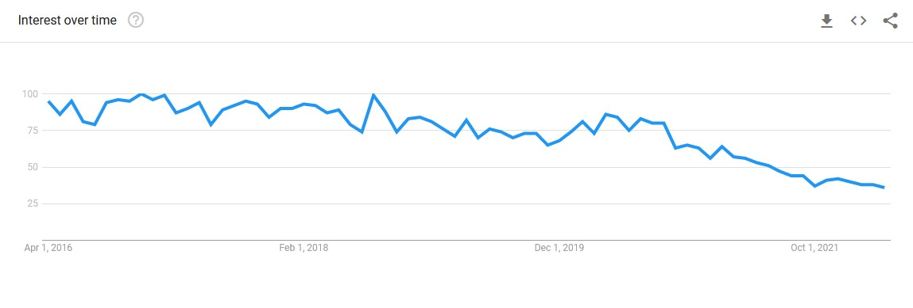
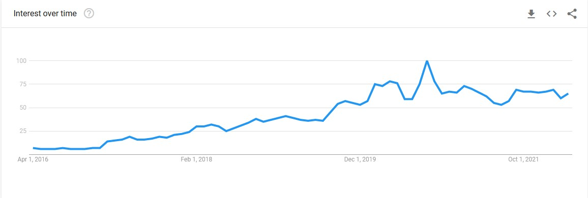
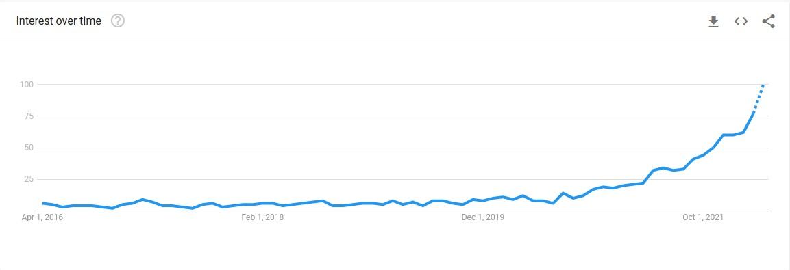

```{r setup, include=FALSE}
knitr::opts_chunk$set(echo = TRUE)
knitr::opts_chunk$set(fig.width=5,fig.height = 5)

options(
  htmltools.dir.version  = FALSE,
  htmltools.preserve.raw = FALSE # needed for windows
)
```

## Overview

--


The early 2000's brought with it an explosion in musical subgenres, fueled by:
- The proliferation of DIY recording material
- The anonymous nature of internet forums
- DAW (Digital Audio Workstation) software that allowed users to splice and chop other samples


--

## Phonk, Vaporwave, and Lofi 

Each of these genres owe some of its origins or revolutions to internet culture in some way
- Vaporwave is generally considered to be the first genre wholly created globally
- Both phonk and lofi have strong influences in digitally created music and edited samples

---

## A Brief History: Vaporwave

- The *BIG DADDY* of internet meme genres
  - The whole point of the genre is a joke
  - Repackaged corporate motifs and retro sounds chopped and sliced to create an entirely recycled piece of music
  - Most vaporwave artists released music anonymously
  - Floral Shoppe - Peak of the corporate meme era
  - The "Death of Vaporwave"
  - New genres emerged - vaportrap, futurefunk, etc.
  - New themes - "Computer Death" by Infinity Frequencies focused on the soullessness of the digital age

``` {r echo=FALSE, out.width='30%', fig.cap='Floral Shoppe Album Cover'}
knitr::include_graphics('floral_shoppe.PNG')
```
---

## A Brief History: Vaporwave - 2



--

"The Death of Vaporwave" - Estimated around the latter half of the 2010's

---
# Vaporwave Example

<figure>
    <figcaption>Floral Shoppe song 1 - Macintosh Plus </figcaption>
    <audio
        controls
        src="vaporwave-edit.mp3">
    </audio>
</figure>

``` {r echo=FALSE, out.width='30%', fig.cap='Vaporwave art is super pink'}

```
---

## A Brief History: Lofi

## Lofi = Low *Fidelity*
- The sound refers to the crackly stereo sounds of DIY beatmakers and low-quality sound compression
- Lofi is known for its nostalgic feel
- Generally incorporates a wide range of images and soundbites from late 90's, early 2000's pop culture (anime like Sailor Moon, Inuyasha, and Cowboy Bebop), along with cartoons like the Simpsons
- Adultswim and Toonami influential in this revolution of lofi

--


---

## A Brief History: Lofi - 2


- The Lofi that we associate with 24 hour Youtube radios and the Lofi study girl is actually a subgenre of the overall lofi genre, an offshoot of the psychedelic rock/early grunge era with the rise of the bedroom musicians
  - The *Lofi Girl* is actually not the original lofi girl!
  - The original "lofi girl" picture is a still of the character Yuki from the anime *Wolf Children*
  
--
.left[
``` {r echo=FALSE, out.width='30%', fig.cap='original lofi girl'}

```
]

.right[
``` {r echo=FALSE, out.width='30%', fig.cap='new lofi girl'}
knitr::include_graphics('new_lofi_girl.jpg')
```
]

---
# Lofi Example

<figure>
    <figcaption>Lofi example: J Dilla - Purple</figcaption>
    <audio
        controls
        src="lofi-edit.mp3">
    </audio>
</figure>

.left[

]
---


## A Brief History: Phonk

- Characterized by use of blurry memphis rap vocals, lofi percussive feel, beatmakers and drum machines, cowbell, and very particular 808 synths
- Sometimes involve jazzy accompaniments along with the grittier sounding beats and vocals 
- Gained attention of the mainstream with the rise of tiktok - videos of cars drifting and other aesthetic videos similar employed phonk music for background audio

--



---

## A Brief History: Phonk - 2

- Phonk became associated with tiktok via background music for cars drifting
  - Other subgenres that highlighted certain qualities emerged
  - Drift phonk, phonk wave

``` {r echo=FALSE, out.width='40%', fig.cap='Evil Wayz - DJ Smokey'}

```

---
# Phonk Example

<figure>
    <figcaption>PHARMACIST - North Memphis</figcaption>
    <audio
        controls
        src="phonk-edit.mp3">
    </audio>
</figure>


---


## The Data:

Collected from the Spotify API using Python

Feature details on tracks in each of Spotify's curated playlists for the genres

Extracted each genre playlist individually and joined them together giving them a genre distinction

```{r message=FALSE}
library(tidyverse)
lofi <- read.csv('lofi.csv')
vaporwave <- read.csv('vaporwave.csv')
phonk <- read.csv('phonk.csv')
lofi <- lofi %>% mutate(genre = "lofi")
phonk <- phonk %>% mutate(genre = "phonk")
vaporwave <- vaporwave %>% mutate(genre = "vaporwave")
interim <- full_join(lofi, phonk)
all_music <- full_join(interim, vaporwave)
```

---

## The Data:

```{r echo=FALSE, out.width='30%'}
library(DT)

all_music %>% DT::datatable()
```

---

## Features:

--

### Mood
- *Danceability* - How easy this song is to dance to. Index value between 0 (least danceable) to 1 (most danceable)
- *Valence* - Positivity of the song. Index value between 0 (most negative) and 1 (most positive)
- *Energy* - Measure of the energy level of the song. Index value between 0 (slowest pace) and 1 (fastest pace)
- *Tempo* - Tempo of the song. Measured in BPM (beats per minute)

--

### Musical Properties
- *Key* - The key of the song, codified in numbers  (0 refers to C)
- *Time Signature* - In 1, 2, 3, or 4 beats per measure
- *Mode* - Major or minor: 1 is major, 0 is minor

--

### Acoustic Properties
- *Loudness* - How loud a song is. Measured in decibels restricted (0 is total restriction, the closer a number is to 0, the louder it is)
- *Instrumentalness* - The amount of instrumentation in a song. Index from 0 (acapella) to 1 (full instrumental)
- *Speechiness* - The amount of spoken/sung word in the song. Index from 0 (none) to 1 (all words)
- *Duration* - The length of the song in milliseconds

---

# Mood

### Valence and Danceability

```{r message=FALSE}
library(ggplot2)
library(plotly)

```

--

.pull-left[
```{r message=FALSE}
p <- ggplot(data=all_music, mapping=aes(x=danceability, fill=as.factor(genre))) + geom_histogram(alpha=0.75) + theme_minimal() + ggtitle('Danceability by Genre') + xlab('danceability') + ylab('frequency')

ggplotly(p)
```
]

.pull-right[
```{r message=FALSE}
p2 <- ggplot(data=all_music, mapping=aes(x=valence, fill=as.factor(genre))) + geom_histogram(alpha=0.75) + theme_minimal() + ggtitle('Valence by Genre') + xlab('valence') + ylab('frequency')

ggplotly(p2)
```
```{r echo=FALSE, message=FALSE}
library(ggplot2)
library(plotly)

```
]

---

# Mood

### Valence and Danceability - Another Perspective

--

.pull-left[
```{r message=FALSE}
p3 <- ggplot(data=all_music, mapping=aes(x=as.factor(genre), y=danceability, fill=genre)) + geom_violin(alpha=0.75) + coord_flip() + geom_jitter() + theme_minimal() + ggtitle('Danceability by Genre') +
  xlab('danceability') + ylab('genre')

ggplotly(p3) 
```
]

.pull-right[
```{r message=FALSE}
p4 <- ggplot(data=all_music, mapping=aes(x=as.factor(genre), y=valence, fill=genre)) + geom_violin(alpha=0.75) + coord_flip() + geom_jitter() + theme_minimal() + ggtitle('Valence by Genre') + xlab('valence') + ylab('genre')

ggplotly(p4)
```
]

---
# Mood 

### Valence and Danceability

.pull-left[

*Mean Valence by Genre*

```{r echo=FALSE}
all_music %>% group_by(genre) %>% summarize(mean_valence = mean(valence)) %>% knitr::kable()
```
]

--

.pull-right[

*Mean Danceability by Genre*

```{r echo=FALSE}
all_music %>% group_by(genre) %>% summarize(mean_danceability = mean(danceability)) %>% knitr::kable()
```
]
---

# Mood

### Energy and Tempo

.pull-left[
```{r message=FALSE}
p <- ggplot(data=all_music, mapping=aes(x=energy, fill=as.factor(genre))) + geom_histogram(alpha=0.75) + theme_minimal() + ggtitle('Energy Distribution by Genre') + xlab('energy') + ylab('frequency')

ggplotly(p)
```
]

.pull-right[
```{r message=FALSE}
p2 <- ggplot(data=all_music, mapping=aes(x=tempo, fill=as.factor(genre))) + geom_histogram(alpha=0.75) + theme_minimal() + ggtitle('Distribution of Tempo by Genre') + xlab('tempo') + ylab('frequency')

ggplotly(p2)
```

]

---
# Mood

### Energy and Tempo

### Fastest/slowest songs in each genre?

*Lofi:*

.left[
```{r}
all_music %>% filter(genre=='lofi') %>% filter(tempo == max(tempo)) %>% select(track_name, artist, tempo) %>% knitr::kable()
```
]

.right[
```{r}
all_music %>% filter(genre=='lofi') %>% filter(tempo == min(tempo)) %>% select(track_name, artist, tempo) %>% knitr::kable()
```
]

.pull-left[
<figure>
    <figcaption>Monster Rally - Phthalo Blue</figcaption>
    <audio
        controls
        src="monster_rally-edit.mp3">
    </audio>
</figure>

]

.pull-right[
<figure>
    <figcaption>Bittersweet Memories - Epifania</figcaption>
    <audio
        controls
        src="bittersweet-edit.mp3">
    </audio>
</figure>
]

---
# Mood

### Energy and Tempo

### Fastest/slowest songs in each genre?

*Vaporwave:*

.left[
```{r}
all_music %>% filter(genre=='vaporwave') %>% filter(tempo == max(tempo)) %>% select(track_name, artist, tempo) %>% knitr::kable()
```
]

.right[
```{r}
all_music %>% filter(genre=='vaporwave') %>% filter(tempo == min(tempo)) %>% select(track_name, artist, tempo) %>% knitr::kable()
```
]

.pull-left[
<figure>
    <figcaption>Hotel Pools - Midnight</figcaption>
    <audio
        controls
        src="hotel_pools-edit.mp3">
    </audio>
</figure>

]

.pull-right[
<figure>
    <figcaption>Uncanny Valley Girl - Donor Lens</figcaption>
    <audio
        controls
        src="uncannyValleyGirl-edit.mp3">
    </audio>
</figure>
]

---
# Mood

### Energy and Tempo

### Fastest/slowest songs in each genre?


*Phonk*

.left[
```{r}
all_music %>% filter(genre=='phonk') %>% filter(tempo == max(tempo)) %>% select(track_name, artist, tempo) %>% knitr::kable()
```
]

.right[
```{r}
all_music %>% filter(genre=='phonk') %>% filter(tempo == min(tempo)) %>% select(track_name, artist, tempo) %>% knitr::kable()
```
]

.pull-left[
<figure>
    <figcaption>Russia Vip - SXGXVX</figcaption>
    <audio
        controls
        src="russia_vip-edit.mp3">
    </audio>
</figure>

]

.pull-right[
<figure>
    <figcaption>ODIUM - LXCT CXNTURY</figcaption>
    <audio
        controls
        src="odium-edit.mp3">
    </audio>
</figure>

]
---
# Mood

### Energy and Tempo - Another Perspective

.pull-left[
```{r message=FALSE}
p3 <- ggplot(data=all_music, mapping=aes(x=as.factor(genre), y=energy, fill=genre)) + geom_violin(alpha=0.75) + coord_flip() + geom_jitter() + theme_minimal() + ggtitle('Violin plot of Energy Distribution by Genre')

ggplotly(p3)
```
]

.pull-right[
```{r message=FALSE}
p4 <- ggplot(data=all_music, mapping=aes(x=as.factor(genre), y=tempo, fill=genre)) + geom_violin(alpha=0.75) + coord_flip() + geom_jitter() + theme_minimal() + ggtitle('Violin plot of Tempo Distribution by Genre')

ggplotly(p4)
```
]

---
# Mood 

### Energy and Tempo

.pull-left[

*Mean Energy by Genre*

```{r echo=FALSE}
all_music %>% group_by(genre) %>% summarize(mean_energy = mean(energy)) %>% knitr::kable()
```
]

--

.pull-right[

*Mean Tempo by Genre*

```{r echo=FALSE}
all_music %>% group_by(genre) %>% summarize(mean_tempo = mean(tempo)) %>% knitr::kable()
```
]
---

# Musical Properties

## Key

```{r}
## Translating number values for key into names of the keys
list_of_keys = c('C','C#','D','D#','E','F','F#','G','G#','A','A#','B')
all_music <- all_music %>% mutate(key_name = list_of_keys[key+1])
all_music %>% select(key_name) %>% unique
```

---

# Musical Properties

## Key

```{r message=FALSE}
p3 <- ggplot(data=all_music, mapping=aes(x=key_name, fill=genre)) + geom_histogram(stat='count', alpha=0.75) + theme_minimal() + ggtitle('Key use by genre') + xlab('key')
ggplotly(p3)
```

---

# Musical Properties

## Key

--

Vaporwave's favorite key:

```{r}

all_music %>% filter(genre=='vaporwave') %>% group_by(key_name) %>% summarize(count=n()) %>% arrange(desc(count)) %>%
    head(1) %>% knitr::kable()
```

--
Lofi's favorite key:

```{r}

all_music %>% filter(genre=='lofi') %>% group_by(key_name) %>% summarize(count=n()) %>% arrange(desc(count)) %>%
    head(1) %>% knitr::kable()
```

--

Phonk's favorite key:

```{r}

all_music %>% filter(genre=='phonk') %>% group_by(key_name) %>% summarize(count=n()) %>% arrange(desc(count)) %>%
    head(1) %>% knitr::kable()
```

---

# Musical Properties

## Mode

```{r message=FALSE}
## Creating a mode name column
all_music <- all_music %>% mutate(mode_name = ifelse(mode == 1, 'major', 'minor'))
```

--

```{r echo=FALSE, message=FALSE}
p4 <- ggplot(data=all_music, mapping=aes(x=mode_name, fill=genre)) + geom_histogram(stat='count',alpha=0.75) + ggtitle('Mode use by Genre') + xlab('Mode')
ggplotly(p4)
```

---

# Musical Properties

## Mode Breakdown

### Vaporwave

```{r}
all_music %>% filter(genre=='vaporwave') %>% group_by(mode_name) %>% summarize(count=n()) %>% knitr::kable()

```

---

# Musical Properties

## Mode Breakdown

### Lofi

```{r}
all_music %>% filter(genre=='lofi') %>% group_by(mode_name) %>% summarize(count=n()) %>% knitr::kable()
```


---

# Musical Properties

## Mode Breakdown

### Phonk

```{r}
all_music %>% filter(genre=='phonk') %>% group_by(mode_name) %>% summarize(count=n()) %>% knitr::kable()
```

---
# Musical Properties

## Keys and Modes Breakdown

### Vaporwave


```{r}
p_vapor <- ggplot(data=all_music %>% filter(genre=='vaporwave'), mapping=aes(x=key_name, fill=mode_name)) +
  geom_histogram(stat='count',alpha=0.75) + ggtitle('Vaporwave') + theme_minimal() + xlab('key')

ggplotly(p_vapor)
```

---
# Musical Properties

## Keys and Modes Breakdown

### Lofi 

```{r}
p_lofi <- ggplot(data=all_music %>% filter(genre=='lofi'), mapping=aes(x=key_name, fill=mode_name)) +
  geom_histogram(stat='count',alpha=0.75) + ggtitle('Lofi') + theme_minimal() + xlab('key')

ggplotly(p_lofi)
```

---
# Musical Properties

## Keys and Modes Breakdown

### Phonk

```{r}
p_phonk <- ggplot(data=all_music %>% filter(genre=='phonk'), mapping=aes(x=key_name, fill=mode_name)) +
  geom_histogram(stat='count',alpha=0.75) + ggtitle('Phonk') + theme_minimal() + xlab('key')

ggplotly(p_phonk)
```

---

# Musical Properties

## Some More with Keys and Modes

### Creating a key column with the key and mode name together

```{r}
all_music <- all_music %>% mutate(key_and_mode = ifelse(mode == 0, paste(key_name, "minor", " "), paste(key_name, "major"," ")))

all_music %>% select(track_name, key_and_mode) %>% head(5)
```

---

# Musical Properties

## Some More with Keys and Modes

--

### Vaporwave's Favorite Key - Modified to show mode

```{r}
all_music %>% filter(genre=='vaporwave') %>% group_by(key_and_mode) %>% unique %>% select(key_and_mode) %>% head(1) %>% knitr::kable()
```

--

### Lofi's Favorite Key - Modified to show mode

```{r}
all_music %>% filter(genre=='lofi') %>% group_by(key_and_mode) %>% unique %>% select(key_and_mode) %>% head(1) %>% knitr::kable()
```

--

### Phonk's Favorite Key - Modified to show mode

```{r}
all_music %>% filter(genre=='phonk') %>% group_by(key_and_mode) %>% unique %>% select(key_and_mode) %>% head(1) %>% knitr::kable()
```


---

# Musical Properties

## Some More with Keys and Modes

.pull-left[
```{r}
plotty <- ggplot(data=all_music %>% filter(mode == 0), mapping=aes(x=key_name, fill=genre)) + geom_histogram(stat='count',alpha=0.75) + ggtitle('Minor Key Usage by Genre') + ylab('Frequency') + theme_minimal()

ggplotly(plotty)
```
]

.pull-right[
```{r}
plotty2 <- ggplot(data=all_music %>% filter(mode == 1), mapping=aes(x=key_name, fill=genre)) + geom_histogram(stat='count',alpha=0.75) + ggtitle('Major Key Usage by Genre') + ylab('Frequency') + theme_minimal()

ggplotly(plotty2)
```
]
---

# Musical Properties

## Time Signature

```{r}
plot <- ggplot(data=all_music, mapping=aes(x=time_signature, fill=genre)) + geom_histogram(stat='count',alpha=0.75) + theme_minimal() + ggtitle('Time Signature use by Genre') + xlab('time signature') + ylab('frequency')
ggplotly(plot)
```

---

# Musical Properties

## Time Signature

### Unusual time signatures - 1 beat per measure

```{r}
all_music %>% filter(time_signature==1) %>% select(track_name, genre, artist) %>% knitr::kable()
```

---
# Musical Properties

## Time Signature

### Unusual time signatures - 3 beats per measure

```{r}
all_music %>% filter(time_signature==3) %>% select(track_name, genre, artist) %>% knitr::kable()
```

---
# Acoustic Properties 

.pull-left[
## Speechiness

```{r}
plotboi <- ggplot(data=all_music, mapping=aes(x=as.factor(genre), y=speechiness, fill=genre)) + geom_violin(alpha=0.75) + ggtitle('Speechiness by Genre') + theme_minimal() + coord_flip() + geom_jitter()
ggplotly(plotboi)
```
]

.pull-right[
## Instrumentalness

```{r}
plotboi2 <- ggplot(data=all_music, mapping=aes(x=as.factor(genre), y=instrumentalness, fill=genre)) + geom_violin(alpha=0.75) + ggtitle('Instrumentalness by Genre') + theme_minimal() + coord_flip() + geom_jitter()
ggplotly(plotboi2)
```
]

---

# Acoustic Properties

# Loudness

```{r}
viz4 <- ggplot(data=all_music, mapping=aes(x=loudness, fill=genre)) + geom_density(alpha=0.7)
ggplotly(viz4)
```

---

# Acoustic Properties

# Duration

```{r}
### Creating a column with minutes
all_music <- all_music %>% mutate(duration_min = duration_ms/60000)

all_music %>% select(duration_min) %>% head(5)
```

---

# Acoustic Properties

# Duration

```{r}
viz5 <- ggplot(data=all_music, mapping=aes(x=duration_min, fill=genre)) + geom_density(alpha=0.7) + ggtitle('Duration Distribution in Minutes') + theme_minimal() + xlab('duration') + ylab('frequency')
ggplotly(viz5) 
```


---

# Acoustic Properties

# Duration

## What's the longest song?

```{r}
all_music %>% filter(duration_min == max(duration_min)) %>% select(track_name, artist, genre, duration_min, tempo, key_and_mode) %>% knitr::kable()
```

--

## Shortest song?

```{r}
all_music %>% filter(duration_min == min(duration_min)) %>% select(track_name, artist, genre, duration_min, tempo, key_and_mode) %>% knitr::kable()
```

---

# Thanks!

--
*References*

https://pitchfork.com/reviews/albums/macintosh-plus-floral-shoppe/

https://www.musicorigins.org/the-origins-of-lo-fi/

https://www.theguardian.com/music/2017/jan/27/phonk-soundcloud-spaceghostpurrp-lil-uzi-vert

https://bookdown.org/yihui/rmarkdown/xaringan.html